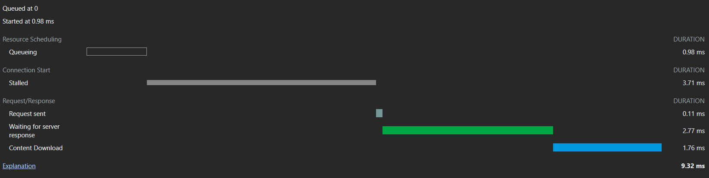

# SQL Query Executor

This project includes a SQL Query Executor at Frontend side only. This is part of Atlan Frontend Assignment, build using React + Vite + TailwindCSS.  It enables users to run SQL queries in an online editor, and analyze the output obtained as a result of running the queries. I used [**Monaco Editor**](https://github.com/suren-atoyan/monaco-react) to embed code editor inside webpage.

<strong> Link to the application: https://atlan-akshat-assignment.netlify.app/</strong>

## Data

The data used in the application is obtained from <https://www.mockaroo.com/>, a website that can easily generate mock data.

## Page Speed and Optimisation

For all the page optimisation analysis, I have used Google's Lighthouse tool and Page Speed Insights to analysze the page load time, along with how well it performs as per web standards.

**Page Load Time:**

## Frameworks + Libraries used

- **React JS** - JavaScript library for building user interfaces that efficiently updates and renders components in response to data changes, enabling the development of dynamic and interactive web applications.

- **Vite** - Vite is a fast and modern build tool for web development that focuses on quick development server start-up, efficient development workflows, and optimized production builds for JavaScript and TypeScript projects.

- **TailwindCSS** - Tailwind CSS is a utility-first CSS framework that provides a set of low-level utility classes, enabling rapid and flexible development of modern and responsive user interfaces.

- **Monaco Editor** - Monaco Editor is a lightweight, feature-rich code editor, designed for embedding into web applications, providing a versatile and customizable code editing experience.

## Optimisations used

1. Despite a slim probability of mobile device usage for this kind of application, the website is very responsive. Sizing units such as em, rem, vh, and vw are used instead of absolute sizing whenever practical.

2. The website is hosted on Vercel, which is considered to be one of the fastest free hosting mechanisms for JavaScript based Web apps due to it's CDN and caching benefits. Additionally, it offers a free SSL for hosting, which is normally better for search engine optimization and website security.

3. Certain portions of the page that are not urgently needed have been loaded in the background using **React Lazy Loading**.

4. Reorganized the code to reuse parts and, where needed, import as little as possible.

5. The page was created with the least amount of dependencies.
